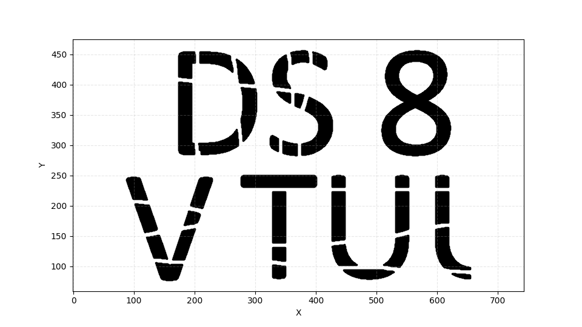

# Лабораторна робота №2: Візуалізація набору даних
## Виконав: Морозов Іван Максимович, КМ-43

---

Створено графічне представлення набору даних з точками, розташованими на координатній площині з сіткою для легшої ідентифікації положення точок.
## Мета роботи
Створити програму мовою Python для зчитування координат точок із текстового файлу та їх графічної візуалізації зі збереженням пропорцій.

### Хід роботи
1. Імпорт бібліотек: Для роботи з графікою було підключено бібліотеку Matplotlib, а саме модуль pyplot (як plt). 
2. Обробка даних:
* Створено порожні списки point_x та point_y для зберігання координат. 
* За допомогою контекстного менеджера with open(...) відкрито файл DS8.txt.

3. Реалізовано цикл по рядках файлу: кожен рядок розділяється на окремі значення (метод split()), які конвертуються у цілі числа (int) та додаються до відповідних списків координат. 
4. Ініціалізовано фігуру заданого розміру (9.6x5.4 дюйма) з розширенням 100 dpi. 
5. Побудовано діаграму розсіювання (scatter plot) за отриманими координатами. 
6. Встановлено рівний масштаб осей для коректного відображення геометричної форми (співвідношення 1:1). 
7. Додано допоміжну сітку та підписи осей.

### Використані інструменти та методи
Бібліотека: `matplotlib.pyplot`

### Ключові методи:

* `plt.figure(figsize=..., dpi=...) `— налаштування розміру та роздільної здатності вікна.

* `plt.scatter(x, y, ...)` — відображення точок на площині (використано параметри кольору c='black', розміру s=10 та маркера marker='.').

* `plt.axis('equal')` — фіксація співвідношення осей (щоб X та Y мали однаковий масштаб).

* `plt.grid()` — відображення сітки.

* `plt.show()` — виведення результату на екран.

---

## Результат
Нижче наведено зображення отриманої візуалізації:

