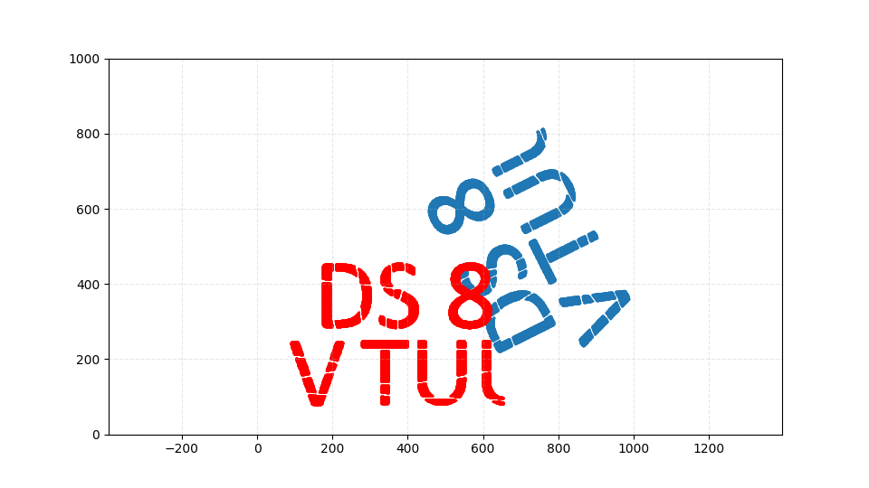

# Лабораторна робота №3: Афінні перетворення з матричною алгеброю
## Виконав: Морозов Іван Максимович, КМ-43

---

## Мета роботи
Виконання обертання набору точок навколо центра (480, 480) з використанням матричних операцій.

## Хід роботи

### 1. Завантаження даних
- Зчитування файлу `DS8.txt` з координатами точок
- Збереження точок у списку для подальшої обробки

### 2. Розрахунок параметрів перетворення
- Обчислення кута обертання: **a = 10 × (n + 1)**, де n = 8
  - Результат: a = 90 градусів
- Конвертація кута з градусів у радіани за допомогою функцій numpy

### 3. Побудова матриці афінного перетворення
Матриця складається з трьох послідовних перетворень:
- **M1** - матриця перенесення центру в початок координат: T(-480, -480)
- **M2** - матриця обертання на кут a (повороту в площині XY)
- **M3** - матриця перенесення центру назад: T(480, 480)
- **Результуюча матриця**: res_matrix = M3 × M2 × M1

### 4. Застосування перетворення
- Конвертація кожної точки в однорідні координати (додавання третьої координати = 1)
- Матричне множення результуючої матриці на вектор точки
- Отримання нових координат трансформованих точок

### 5. Збереження результатів
- Запис трансформованих точок у файл `new_DS8.txt`
- Візуалізація: порівняння оригінальних точок (червоний колір) з трансформованими (чорний колір)

## Використовувані бібліотеки

### `numpy (np)`
- `np.matrix()` - створення матриць для афінних перетворень
- `np.cos() / np.sin()` - обчислення тригонометричних функцій
- `Оператор @` - матричне множення
- `np.array()` - конвертація списків у масиви
- `.T` - операція транспонування матриці

### `matplotlib.pyplot`
- **figure()** - налаштування розміру графіка
- **scatter()** - відображення точок
- **plot()** - рисування ліній
- **xlim() / ylim()** - встановлення меж осей
- **grid()** - сітка на графіку
- **show()** - виведення результату

## Ключові методи
- Матричні операції для афінних перетворень
- Однорідні координати для представлення афінних перетворень
- Композиція матриць перетворень для отримання результуючої матриці

## Результати
Успішно виконано обертання 90° всіх точок навколо центра (480, 480). Оригінальні та трансформовані точки виведені на один графік для порівняння.

